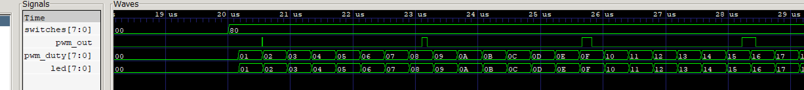
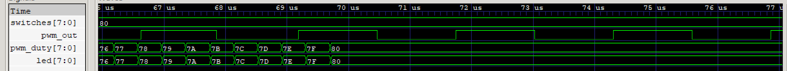

# Test Report — MIPS PWM Motor Controller

## 1. Motor Profile Verification

**Profile implemented: Option D — Two-stage (accelerate to switch-set target, then hold)**

The CPU continuously reads `switches` as a target speed each loop iteration. It ramps `pwm_duty` up or down by 1 per iteration until `current_duty == switches`, then holds. The testbench drives the switches through four phases to verify this behavior.

### Testbench Phases

| Phase | Time (ns) | switches value | Expected behavior |
|---|---|---|---|
| Phase 1 | 0 – 20,015,000 ns | `0x00` (0) | Duty stays at 0, PWM output stays low |
| Phase 2 | 20,015,000 – 100,015,000 ns | `0x80` (128) | Duty ramps up 0 → 128, then holds |
| Phase 3 | 100,015,000 – 180,015,000 ns | `0x20` (32) | Duty ramps down 128 → 32, then holds |
| Phase 4 | 180,015,000 – 280,015,000 ns | `0xFF` (255) | Duty ramps up 32 → 255, reaches target at ~266,905,000 ns |

### Simulation Output (key transitions)

```
[15,000 ns]       Reset released, CPU starts
[20,015,000 ns]   switches → 0x80 (128)
[20,185,000 ns]   duty: 0 → 1  (ramp-up begins)
[69,715,000 ns]   duty: 127 → 128  (target reached, hold)
[100,015,000 ns]  switches → 0x20 (32)
[100,325,000 ns]  duty: 128 → 127  (ramp-down begins)
[120,275,000 ns]  duty: 33 → 32  (target reached, hold)
[180,015,000 ns]  switches → 0xFF (255)
[180,325,000 ns]  duty: 32 → 33  (ramp-up begins)
[266,905,000 ns]  duty: 254 → 255  (target reached)
Simulation Complete
```

## Waveform Screenshots

### Figure 1. Acceleration phase (switches = 0x80)



Figure 1. Acceleration phase (switches = 0x80).
After switches is set to 0x80, the CPU reads the target each loop iteration and increments `pwm_duty` and `led` by 1 per step. The PWM output pulse width visibly widens as `pwm_duty` increases from 0 toward the target value 0x80 (128).This demonstrates the Option D ramp-up behavior, where the duty cycle changes by only one count per control-loop iteration rather than jumping directly to the target value.

### Figure 2. Target reached and hold phase



Figure 2. Target reached and hold phase.
`pwm_duty` reaches 0x80 (128) and remains constant while `switches` stays at 0x80. Once `current_duty == switches`, neither the accelerate nor the decelerate branch is taken, and the duty cycle holds steady. The PWM pulse width remains fixed at approximately 50% because pwm_duty no longer changes once the target value is reached.

The waveform shows:
- **Ramp-up region**: `led` and `pwm_duty` increase by 1 each control loop iteration while `current_duty < target`.
- **Hold region**: once `current_duty == switches`, neither `bne accelerate` nor `bne decelerate` is taken, and duty stays constant.
- **Ramp-down region**: when switches drops to `0x20`, `current_duty > target`, so the `addi $t0, $t0, -1` path executes each iteration.
- **PWM pulse width**: visibly widens as duty increases and narrows as duty decreases, confirming the counter-comparator is tracking `pwm_duty` correctly.

### How the Assembly Produces This Pattern

The main loop reads `switches` into `$t1` each iteration via `lw $t1, 0x90($zero)`. Two `slt` + `bne` pairs determine whether to increment or decrement `$t0` (current duty). After updating `$t0`, it is written to both `0x98` (PWM duty) and `0x94` (LED) via `sw`. A 100-iteration delay loop then runs before the next iteration, slowing the control update rate and producing the smooth visible ramp observed in simulation. Based on the measured waveform, one ramp step occurs approximately every 390 μs.

---

## 2. Edge Cases Tested

### Edge Case 1: PWM Enable = 0 at startup

At reset, `pwm_en` initializes to `0` and `pwm_duty` initializes to `0`. The PWM controller holds `pwm_out` low and freezes its counter at 0 while `enable = 0`. The first two instructions in `memfile.dat` write `1` to address `0x9C` to enable the PWM before any duty value is set. Until that `sw` completes the MEM stage, `pwm_out` remains `0` regardless of counter activity.

**Result**: `pwm_out` stays low for the first few clock cycles after reset, then begins operating once the enable write reaches the MMIO register. This is correct behavior — the motor stays off until the software explicitly enables it. Confirmed by `DEBUG: Time=55000 pwm_duty=0 pwm_en=1 led=0` appearing in simulation output shortly after reset release at 15,000 ns.

### Edge Case 2: duty = 0 and duty = 255

**duty = 0**: The condition `counter < 0` is never true for an 8-bit unsigned counter, so `pwm_out` is always `0`. The motor receives no power.

**duty = 255**: `counter < 255` is true for 255 out of every 256 cycles (≈99.6% high). `pwm_out` goes low for only 1 cycle per period.

Both extremes are handled correctly by the comparator without any special-case logic, because the 8-bit counter naturally wraps 0–255 and the `<` comparison gives the correct result at both boundaries.

**Verification**: In Phase 1 (`switches = 0x00`), the CPU writes `0` to `0x98` and `pwm_out` is flat-low in the waveform. In Phase 4 (`switches = 0xFF`), after the ramp completes at 266,905,000 ns, `pwm_out` is nearly always high with only a 1-cycle low pulse per period — visible as a nearly-solid high signal in GTKWave at default zoom.

### Edge Case 3 (Option D specific): switches changes faster than the loop can track

If `switches` changes between two consecutive `lw $t1, 0x90($zero)` reads (i.e., faster than one control loop iteration ≈ 390 μs), the intermediate value is skipped. The CPU picks up the new value on the next `lw`. Because the loop adjusts duty by ±1 per iteration, a sudden large step change in `switches` (e.g., `0x00` → `0xFF`) causes a gradual ramp rather than an instant jump, preventing abrupt motor jolts.

**Verification**: The Phase 3 → Phase 4 transition (`0x20` → `0xFF`, a step of 223) shows duty ramping up from 32 over multiple iterations rather than snapping to 255 immediately. The ramp from 32 → 255 takes approximately 86,890,000 ns (266,905,000 − 180,015,000 ns), covering 223 steps at about 390 μs per step. The theoretical prediction is:

223 × 390 μs = 86,970 μs = 86.97 ms

This is close to the measured 86.89 ms, with an error of about 0.08 ms (80 μs). The measured ramp duration closely matches the theoretical value, confirming the ramp-rate behavior.

---

## 3. Pipeline Verification

The pipelined CPU successfully executes the motor-control program without incorrect results. Data forwarding resolves most read-after-write dependencies without stalling, while the hazard unit inserts stalls only when required for load-use situations. Branch instructions (`bne`) used in the accelerate, decelerate, and delay-loop paths are resolved correctly in the ID stage with a single-cycle penalty, and the duty-cycle tracking algorithm executes continuously without pipeline-related errors during simulation. Confirmed by the absence of incorrect duty-cycle values or missed transitions throughout all four testbench phases.
